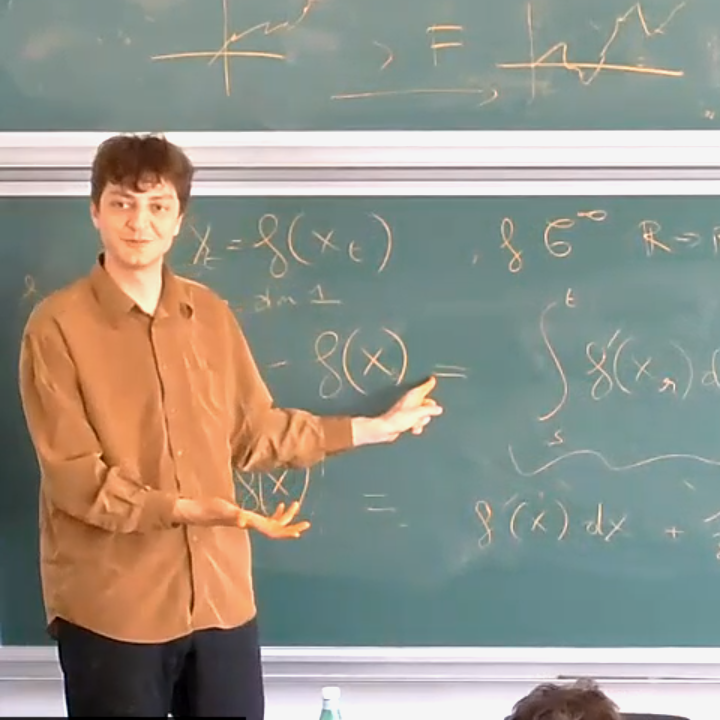

{width=220px}

I am a postdoctoral researcher in the
[DYNASNET](https://dynasnet.renyi.hu/) group at the
[Alfréd Rényi Institute of Mathematics](https://www.renyi.hu/),
working with
[Miklós Abért](https://users.renyi.hu/~abert/).

I completed my PhD at Aix–Marseille University under the supervision of
[Charles Bordenave](https://www.i2m.univ-amu.fr/perso/charles.bordenave/),
after graduating from École normale supérieure Paris-Saclay
(formerly ENS Cachan, Master
[MVA](https://www.master-mva.com/)).

My research lies at the intersection of probability, geometry,
and spectral analysis, with a focus on large random graphs and
complex networks.

---

**Contact:** `arras@renyi.hu`

<a href="https://arxiv.org/search/?searchtype=author&query=Arras%2C+A" aria-label="arXiv">
  <i class="ai ai-arxiv"></i>
</a>
&nbsp;
<a href="https://github.com/adamarras" aria-label="GitHub">
  <i class="fab fa-github"></i>
</a>

<!--
&nbsp;
<a href="https://scholar.google.com/citations?user=YOUR_ID" aria-label="Google Scholar">
  <i class="ai ai-google-scholar"></i>
</a>
-->
