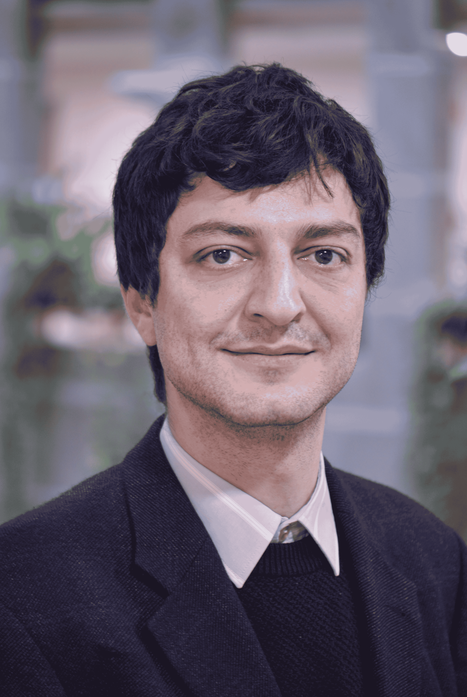

{width=260px}

I am a mathematician specializing in probability. I am currently a postdoctoral researcher in the
[DYNASNET](https://dynasnet.renyi.hu/) group at the
[Alfréd Rényi Institute of Mathematics](https://www.renyi.hu/),
working with
[Miklós Abért](https://users.renyi.hu/~abert/).

I received my PhD in mathematics from Aix–Marseille University under the supervision of
[Charles Bordenave](https://www.i2m.univ-amu.fr/perso/charles.bordenave/),
after graduating from École normale supérieure Paris-Saclay
and the
[MVA master's programme](https://www.master-mva.com/).

My research combines spectral methods and network science, with a focus on random graphs, Markov chains and stochastic processes. More broadly, I am interested in scientific computing and machine learning.

---

**Email:** `arras@renyi.hu`

&nbsp;

&nbsp;
<a href="https://github.com/adamarras" aria-label="GitHub">
  <i class="fab fa-github"></i>
</a>
&nbsp;
<a href="https://www.linkedin.com/in/adam-arras" aria-label="LinkedIn">
  <i class="fab fa-linkedin"></i>
</a>

